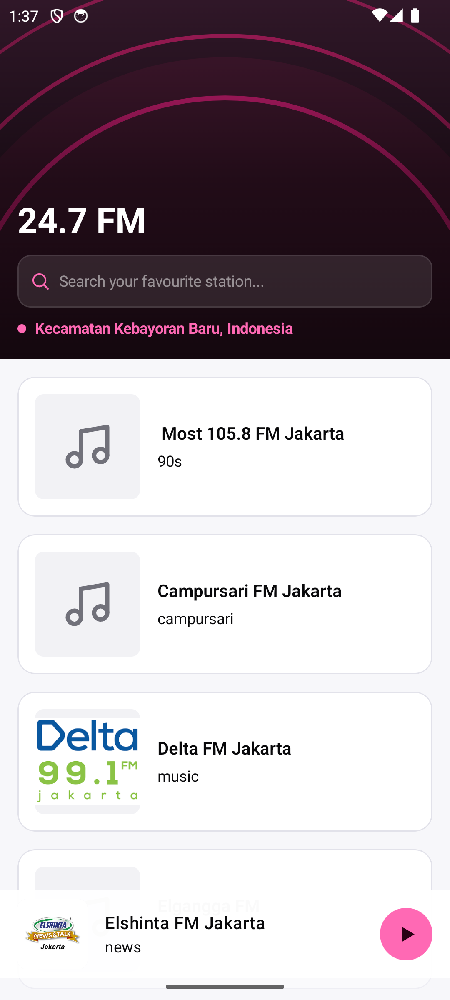
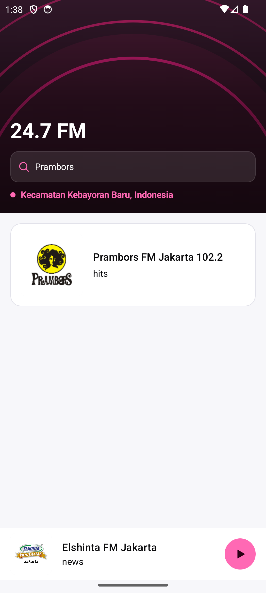
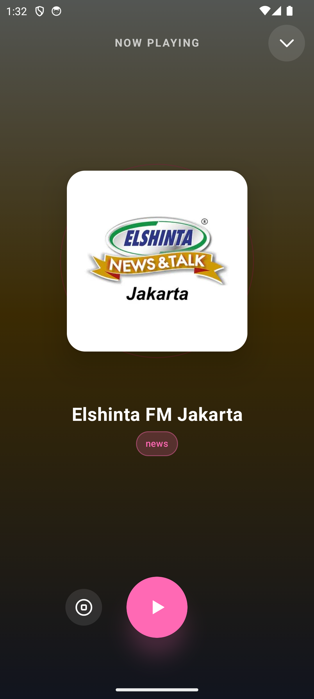

# 24.7 FM - Android Radio App

A modern Android application for streaming radio stations, built with Jetpack Compose and following clean architecture principles.

## 📱 Features

- **Explore Stations**: Browse a wide variety of radio stations.
- **Location-Based Discovery**: Find local stations based on your current location.
- **Search**: Quickly find your favorite radio stations.
- **Rich Media Player**: Full-featured player with dynamic colors extracted from station artwork.
- **Background Playback**: Continue listening even when the app is in the background.

## 📸 Screenshots

| Home (Expanded) | Search | Full Player |
| :---: | :---: | :---: |
|  |  |  |

## 🛠 Tech Stack

- **Language**: Kotlin 2.2.20
- **UI Framework**: Jetpack Compose
- **Architecture**: Multi-module Clean Architecture + MVI/MVVM
- **Dependency Injection**: Hilt
- **Media Playback**: Media3 (ExoPlayer)
- **Networking**: Retrofit + OkHttp + Moshi
- **Image Loading**: Coil
- **Analytics & Errors**: Sentry, Timber
- **Static Analysis**: Detekt

## 🏗 Project Structure

```
 ├── app/              # Android application entry point
 ├── feature/          # Feature-specific modules (e.g., stationlist)
 ├── core/             # Shared low-level modules (design, network, radioplayer, tracker)
 ├── domain/           # Domain layer (api, impl)
 ├── infrastructure/   # Infrastructure implementations
 ├── build-logic/      # Custom Gradle convention plugins
 └── docs/             # Documentation and screenshots
```

## 🚀 Getting Started

### Prerequisites

- Android Studio Ladybug or newer
- JDK 17
- Android SDK 36

### Build and Run

To build the development debug version:

```bash
./gradlew assembleDevDebug
```

To run unit tests:

```bash
./gradlew testDevDebugUnitTest
```

## 📄 License

This project is licensed under the Apache License 2.0 - see the [LICENSE](LICENSE) file for details.
